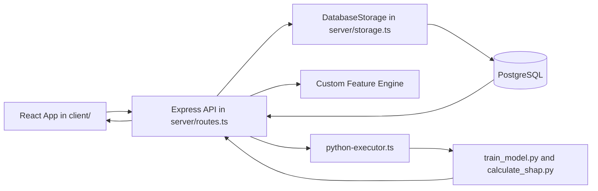

# ML Orion Developer Guide

This document is a code-first walkthrough of the project for developers who need to understand how the application is structured, how the major workflows behave at runtime, and where to make changes safely.

It is intentionally more detailed than the README and is written from the current implementation, not just the package list.

## 1. What This Project Is

ML Orion is a single-repository churn intelligence platform with two product surfaces running on the same stack:

- Business intelligence dashboards for churn analysis, risk monitoring, retention actions, and business impact.
- An ML operations workspace called Orion for dataset ingestion, feature engineering, model training, deployment, monitoring, outcomes, and governance.

At runtime, this is a single Node.js server that:

- serves the React frontend,
- exposes REST APIs,
- talks to PostgreSQL through Drizzle ORM,
- and delegates model training and explainability work to Python scripts.

The most important architectural fact in the repo is this:

The app is not split into separate frontend, backend, and model-serving services. It is one full-stack application with Python subprocess execution embedded into the backend workflow.

## 2. Recommended Reading Order

If you are new to the repo, read files in this order:

1. `README.md`
2. `codebase-structure.md`
3. `client/src/App.tsx`
4. `server/index.ts`
5. `server/routes.ts`
6. `server/storage.ts`
7. `shared/schema.ts`
8. `server/custom-feature-engine.ts`
9. `server/python-executor.ts`
10. `server/python-ml/train_model.py`

That sequence gives you the runtime path from browser to database to Python.

## 3. Repository Layout

```text
ML_Orion/
|- client/                    React frontend
|- server/                    Express backend and orchestration layer
|- server/python-ml/          Python ML and explainability scripts
|- shared/                    Shared schema and contract definitions
|- script/                    Build scripts
|- attached_assets/           Imported notes and reference assets
|- codebase-structure.md      Short structure guide
|- README.md                  Short project overview
|- replit.md                  Older project notes, partly historical
|- drizzle.config.ts          Drizzle Kit configuration
|- vite.config.ts             Vite frontend config
|- tailwind.config.ts         Tailwind config
|- package.json               App scripts and dependencies
```

## 4. High-Level Architecture



The main pieces are:

- Frontend SPA: React plus TypeScript plus Wouter plus TanStack Query.
- Backend API: Express plus TypeScript.
- Persistence: PostgreSQL via Drizzle ORM.
- ML layer: Python scripts invoked from Node.
- Shared contract: Drizzle schema plus Zod types in `shared/schema.ts`.

## 5. Frontend Architecture

### Entry point

The browser boot path is:

- `client/src/main.tsx`
- `client/src/App.tsx`

`client/src/main.tsx` mounts the React tree.

`client/src/App.tsx` does three things:

- registers top-level routes with Wouter,
- wraps the app with `QueryClientProvider`,
- applies the shared sidebar layout used by most routes.

### Routing model

The route table in `client/src/App.tsx` is the primary map of product areas.

Business analytics routes:

- `/`
- `/churn-diagnostics/:tab?`
- `/risk-intelligence/:tab?`
- `/retention/:tab?`
- `/business-impact/:tab?`
- `/strategy/:tab?`

Orion routes:

- `/orion/overview`
- `/orion/data`
- `/orion/experiments`
- `/orion/deploy`
- `/orion/outcomes`
- `/orion/governance`

Demo routes:

- `/demo/:industry/:useCase`
- `/demo/:industry/:useCase/:section`
- `/demo/:industry/:useCase/orion/:page`

### State and data fetching

The app uses TanStack Query for almost all server interactions.

The query client is defined in `client/src/lib/queryClient.ts`.

Patterns used throughout the frontend:

- `useQuery` for screen data loading
- `useMutation` for writes such as upload, training, deploy, approval, and status updates
- invalidation of query keys after mutations to refresh dependent screens

This means the frontend is intentionally thin. Most real business logic lives server-side.

### Styling and UI system

The design system uses:

- Tailwind CSS
- shadcn-style wrappers
- Radix UI primitives
- Lucide React icons
- Recharts for charts

Important files:

- `client/src/index.css`
- `tailwind.config.ts`
- `components.json`
- `client/src/components/ui/*`

Shared layout components:

- `client/src/components/app-sidebar.tsx`
- `client/src/components/orion-layout.tsx`
- `client/src/components/kpi-card.tsx`

### Frontend folder responsibilities

`client/src/pages/`

- Route-level screens.

`client/src/components/`

- Shared presentational and layout components.

`client/src/components/ui/`

- Reusable design-system primitives.

`client/src/lib/`

- Query client, utility helpers, and shared frontend plumbing.

`client/src/hooks/`

- Reusable hooks such as mobile detection and toast behavior.

## 6. Backend Architecture

### Server bootstrap

The backend starts in `server/index.ts`.

That file:

- creates the Express app,
- configures JSON and URL-encoded body parsing,
- installs request logging for API routes,
- calls `registerRoutes(...)` from `server/routes.ts`,
- mounts Vite middleware in development,
- serves built frontend assets in production.

The server is intentionally simple. Nearly all application behavior is inside `server/routes.ts`.

### Main backend layers

`server/routes.ts`

- Request handlers, workflow orchestration, dataset parsing, training orchestration, scoring orchestration, monitoring APIs, governance APIs.

`server/storage.ts`

- Database CRUD plus analytics aggregation logic.

`server/db.ts`

- Postgres connection and Drizzle binding.

`server/custom-feature-engine.ts`

- Dataset-level feature transformation logic used before training and production scoring.

`server/python-executor.ts`

- Temporary JSON file management and Python process invocation.

### Runtime design principle

The backend follows a consistent pattern:

1. Route handler validates request and loads prerequisite data.
2. Route handler may enrich or transform data in TypeScript.
3. Route handler either calls storage methods, Python, or both.
4. Results are persisted.
5. Route returns frontend-friendly JSON.

## 7. Shared Contract Layer

The shared contract is in `shared/schema.ts`.

This file is one of the most important in the repo because it defines:

- the database tables,
- the insert schemas,
- shared TypeScript types,
- the custom feature definition schema used by both frontend and backend.

Main tables:

- `customers`
- `churn_events`
- `datasets`
- `ml_models`
- `predictions`
- `recommendations`
- `audit_log`
- `model_evaluation_runs`

Notable design decisions:

- Dataset artifacts like quality reports, EDA reports, feature reports, and previews are stored as JSONB.
- Model artifacts like feature importance, hyperparameters, confusion matrix, and model weights are also stored as JSONB.
- The schema supports governance metadata directly on `ml_models`, such as approval status and approver identity.

## 8. Database Layer

`server/db.ts` creates the PostgreSQL connection using `DATABASE_URL`.

`server/storage.ts` uses Drizzle ORM to:

- perform direct CRUD operations,
- aggregate business analytics,
- persist model outputs,
- store evaluation runs,
- support governance and audit features.

### What belongs in storage.ts

`server/storage.ts` is not just a repository layer. It also contains business-facing analytics aggregations.

Examples:

- Command Center metrics
- Churn diagnostics
- Risk intelligence summaries
- Retention queue and tracker data
- Business impact and ROI summaries
- Strategy insight summaries

This is why many route handlers in `server/routes.ts` are thin wrappers over storage methods.

## 9. Python ML Layer

The active ML implementation lives in `server/python-ml/`.

Main files:

- `train_model.py`
- `calculate_shap.py`
- `requirements.txt`
- `churn_pipeline_complete.py`

### Active scripts

`train_model.py`

- Main training path.
- Used for dataset training, live training, and production scoring mode.
- Handles preprocessing, model-family selection, metrics, feature importance, and latest active scoring.

`calculate_shap.py`

- Used for explanation output and SHAP driver calculation.
- Also supports fallback recommendation generation logic.

### Python execution model

The Node backend never imports Python directly.

Instead, `server/python-executor.ts` does the following:

1. resolves the active `python-ml` folder,
2. writes the input payload to a temporary JSON file,
3. chooses a Python interpreter candidate,
4. runs the script via child process,
5. reads the output JSON,
6. returns parsed results to the route handler.

Important runtime details:

- Windows and non-Windows interpreter fallbacks are handled explicitly.
- The executor prefers the checked-out `server/python-ml` directory over `dist/python-ml`.
- Output is read from a JSON file first, then stdout fallback parsing is attempted.

## 10. Build and Runtime Tooling

### Development

The main dev command is:

```bash
npm run dev
```

This runs the server entrypoint through `tsx` and mounts Vite in middleware mode.

### Production build

Production build is handled by `script/build.mjs`.

Build steps:

1. remove the `dist/` directory,
2. build the frontend using Vite,
3. bundle the backend with esbuild into `dist/index.cjs`,
4. copy `server/python-ml` into `dist/python-ml`.

This is important: Python scripts are runtime assets and must remain accessible after bundling.

### Other important config files

- `vite.config.ts`
- `tailwind.config.ts`
- `postcss.config.js`
- `drizzle.config.ts`
- `tsconfig.json`

## 11. Core Runtime Flows

### A. Upload CSV to trained model

1. User opens the Orion Data page.
2. Frontend uploads a CSV to `POST /api/datasets/upload`.
3. The backend parses the CSV with Multer plus PapaParse.
4. The backend computes column stats with `simple-statistics`.
5. A dataset record is stored in Postgres.
6. User optionally runs quality, EDA, feature-selection, and custom-feature actions.
7. User opens Orion Experiments.
8. Frontend sends a training request to `POST /api/models/train`.
9. Backend reloads dataset rows from stored compressed CSV.
10. Backend reapplies saved custom features if they exist.
11. Backend calls `train_model.py` through `python-executor.ts`.
12. Python returns metrics, feature importance, and often prediction payloads.
13. Backend stores the model in `ml_models`.
14. Backend persists predictions and recommendations.
15. Frontend reloads models, overview, predictions, and outcomes screens.

### B. Train from live customer data

1. User chooses live training in Orion Experiments.
2. Frontend sends a request to `POST /api/models/train-live`.
3. Backend loads rows from the `customers` table.
4. Backend validates that both churned and non-churned records exist.
5. Backend calls `train_model.py` with live customer rows.
6. Backend stores model metrics and then persists scored active-customer predictions.

### C. Score a production dataset

1. User selects a trained model and a production dataset in Orion Deploy.
2. Frontend calls `POST /api/models/:id/score-production`.
3. Backend reloads original training dataset rows.
4. Backend reloads production dataset rows.
5. Backend reapplies the same custom features used by the model.
6. Backend calls `train_model.py` in `score_prod` mode.
7. Backend persists the resulting predictions.
8. Backend computes monitoring summaries such as PSI, KS, histograms, and SHAP summaries.
9. Backend stores a row in `model_evaluation_runs`.
10. Orion Deploy and Governance can now read the new evaluation snapshot.

### D. Explain model predictions

1. Risk Intelligence or other pages request SHAP drivers.
2. Frontend calls `POST /api/customers/shap-drivers`.
3. Backend loads the model and relevant customers.
4. Backend calls `calculate_shap.py`.
5. Python returns top drivers and recommendation metadata.
6. Frontend renders customer-level explanation output.

## 12. Orion Pages, One by One

### `orion-overview.tsx`

Purpose:

- executive summary of model inventory and model health

Main API dependencies:

- `GET /api/orion/overview`
- `GET /api/models`
- `GET /api/code/files`
- `GET /api/code/:fileId`
- `PUT /api/code/:fileId`

What it shows:

- total models
- deployed models
- average AUC for deployed models
- total predictions
- dataset count
- customer risk distribution
- model registry table
- backend code explorer

### `orion-data.tsx`

Purpose:

- data ingestion and data preparation workspace

Main API dependencies:

- `GET /api/datasets`
- `GET /api/orion/eda-live`
- `GET /api/models`
- `GET /api/models/latest/features`
- `GET /api/datasets/:id/custom-features`
- `POST /api/datasets/upload`
- `POST /api/datasets/:id/quality-check`
- `POST /api/datasets/:id/eda`
- `POST /api/datasets/:id/feature-selection`
- custom feature validate, preview, create, delete endpoints

What it does:

- upload CSVs
- inspect dataset registry
- run quality checks
- run EDA
- inspect feature scores
- build and persist custom engineered features

### `orion-experiments.tsx`

Purpose:

- train models and compare them

Main API dependencies:

- `GET /api/models`
- `GET /api/datasets`
- `GET /api/orion/customer-dataset`
- `GET /api/orion/algorithms`
- `POST /api/models/train`
- `POST /api/models/train-live`
- `POST /api/models/:id/deploy`
- `DELETE /api/models/:id`

What it does:

- choose training source
- select algorithm and hyperparameters
- trigger training
- compare model metrics and feature importance
- optionally deploy or delete a model

### `orion-deploy.tsx`

Purpose:

- production activation, scoring, and monitoring

Main API dependencies:

- `GET /api/models`
- `GET /api/predictions`
- `GET /api/customers/stats`
- `GET /api/datasets`
- `GET /api/monitoring/:modelId`
- `POST /api/models/:id/deploy`
- `POST /api/models/:id/undeploy`
- `POST /api/models/:id/predict-customers`
- `POST /api/models/:id/score-production`
- `POST /api/models/:id/approve`
- `DELETE /api/models/:id`

What it does:

- manage deployed state
- score active customers
- score production datasets
- display monitoring snapshots
- display drift and feature-driver changes
- submit approval decisions

### `orion-outcomes.tsx`

Purpose:

- track post-scoring action outcomes and value generated

Main API dependencies:

- `GET /api/analytics/retention`
- `GET /api/models`
- `GET /api/predictions`
- `PATCH /api/recommendations/:id`
- `GET /api/datasets/unique-account-counts`

What it shows:

- action queue status
- save rate by action type
- revenue protected over time
- model attribution summaries
- outcome distribution from completed retention actions

### `orion-governance.tsx`

Purpose:

- registry, compliance, and audit trail

Main API dependencies:

- `GET /api/orion/governance`

What it shows:

- total models and deployed models
- approved and pending models
- compliance coverage
- audit events
- registry with lineage and approval state

## 13. `routes.ts` Walkthrough By Endpoint Group

This is the mental model for `server/routes.ts`.

### Group 1: helper and workflow support code

At the top of the file you will find helper functions for:

- dataset row storage and reconstruction
- CSV compression and decompression
- feature report extraction
- custom feature retrieval and normalization
- latest active row filtering
- SHAP algorithm normalization
- parameter parsing

These helpers are heavily reused by later route handlers.

### Group 2: analytics and customer APIs

These endpoints expose the business dashboard data:

- `/api/dashboard`
- `/api/segments`
- `/api/analytics/command-center`
- `/api/analytics/churn-diagnostics`
- `/api/analytics/risk-intelligence`
- `/api/analytics/retention`
- `/api/analytics/business-impact`
- `/api/analytics/strategy`

They mostly delegate to aggregation methods in `server/storage.ts`.

Customer-related endpoints in this section:

- `/api/customers`
- `/api/customers/stats`
- `/api/customers/:id`
- `/api/customers/shap-drivers`
- `/api/predictions`

### Group 3: notebook import and recommendation APIs

These endpoints integrate notebook artifacts into the app:

- `/api/notebook-output`
- `/api/import-notebook-predictions`

They are not the main ML path, but they allow external notebook results to be imported into the same persistence model.

The same section also handles:

- `/api/recommendations`
- `/api/recommendations/:id`
- `/api/churn-events`

### Group 4: dataset and feature-engineering APIs

This section includes:

- `/api/datasets`
- `/api/datasets/unique-account-counts`
- `/api/datasets/:id/custom-features`
- `/api/datasets/:id/custom-features/validate`
- `/api/datasets/:id/custom-features/preview`
- `/api/datasets/:id/custom-features`
- `/api/datasets/:id/custom-features/:featureId`
- `/api/datasets/:id`
- `/api/datasets/upload`
- `/api/datasets/:id/quality-check`
- `/api/datasets/:id/eda`
- `/api/datasets/:id/feature-selection`

This is the ingestion and data-prep heart of the backend.

### Group 5: model lifecycle APIs

This section covers:

- `/api/models`
- `/api/models/:id`
- `/api/models/train`
- `/api/models/train-live`
- `/api/models/:id/deploy`
- `/api/models/:id/undeploy`
- `/api/models/:id`
- `/api/models/latest/features`
- `/api/models/:id/approve`
- dataset deletion and audit-log routes

This is the model training and governance heart of the backend.

### Group 6: Orion operational APIs

This section powers the Orion workspace directly:

- `/api/orion/eda-live`
- `/api/orion/overview`
- `/api/orion/customer-dataset`
- `/api/models/:id/predict-customers`
- `/api/models/:id/score-production`
- `/api/orion/governance`
- `/api/monitoring/:modelId`

These routes are the operational bridge between stored model state and the Orion UI.

### Group 7: code explorer APIs

The final section exposes a safe file allowlist for the frontend code explorer:

- `/api/code/files`
- `/api/orion/algorithms`
- `/api/code/:fileId`
- `/api/code/:fileId` with PUT

These are developer-support features embedded into the product UI.

## 14. `storage.ts` Walkthrough

`server/storage.ts` contains two categories of behavior.

### Category A: CRUD and persistence

It defines methods for creating, updating, deleting, and reading:

- customers
- churn events
- datasets
- models
- predictions
- recommendations
- audit log entries
- model evaluation runs

This is the persistence API used by `routes.ts`.

### Category B: analytics aggregation

It also computes the data returned to the business dashboards.

Major aggregation methods:

- `getChurnAnalytics()`
- `getSegmentAnalytics()`
- `getCommandCenterData()`
- `getChurnDiagnostics()`
- `getRiskIntelligence()`
- `getRetentionData()`
- `getBusinessImpact()`
- `getStrategyInsights()`

These methods combine raw customer, prediction, and recommendation data into frontend-friendly summaries.

Important implication:

The frontend is intentionally not responsible for deriving most business KPIs. Those calculations are centralized in `storage.ts`.

## 15. Important Cross-Cutting Concepts

### Dataset storage model

Uploaded dataset rows are not only kept as a small preview. The backend stores:

- preview rows,
- a sampled subset,
- and a compressed full CSV payload.

That allows the server to reconstruct full datasets later for training and scoring without needing a separate object store.

### Custom feature persistence model

Custom engineered features are stored inside `datasets.featureReport.customFeatures` and may also be snapshotted inside `ml_models.modelWeights.customFeatures`.

That allows:

- feature preview before save,
- deterministic reapplication during training,
- deterministic reapplication during production scoring.

### Deployment model

Deployment is a database state transition, not a separate deployment target.

When a model is deployed:

- `isDeployed` is set,
- status changes to deployed,
- audit logs are written.

The same Node app continues to serve all scoring and monitoring APIs.

### Monitoring model

Monitoring is built from persisted prediction and evaluation data. It is not an external observability service.

Real monitoring data is stored in `model_evaluation_runs` and exposed by `/api/monitoring/:modelId`.

### Governance model

Governance is supported directly in the schema through:

- approval status
- approved by
- approved at
- approval notes
- audit log entries

## 16. Active vs Legacy Code Paths

The active ML path today is Python-based.

Files that are part of the active path:

- `server/routes.ts`
- `server/storage.ts`
- `server/custom-feature-engine.ts`
- `server/python-executor.ts`
- `server/python-ml/train_model.py`
- `server/python-ml/calculate_shap.py`

Files that look historical or secondary:

- `server/ml-trainer.ts`
- `server/routes1.ts`
- `client/src/pages/orion-overview1.tsx`
- `client/src/pages/orion-experiments1.tsx`
- `client/src/pages/demo-orion1.tsx`

Those files are worth reviewing before deletion, but they are not the primary route path used by `client/src/App.tsx`.

`replit.md` also contains older notes that do not fully match the current Python-first ML path.

## 17. Common Change Scenarios

### Add a new frontend screen

1. Add a page in `client/src/pages/`.
2. Register the route in `client/src/App.tsx`.
3. Add sidebar navigation if needed in `client/src/components/app-sidebar.tsx`.
4. Add backend routes if the screen needs new data.

### Add a new API endpoint

1. Implement the route in `server/routes.ts`.
2. Add or reuse storage methods in `server/storage.ts`.
3. Extend `shared/schema.ts` if the shape needs new persisted fields.
4. Call it from the frontend using React Query.

### Add a new custom feature type

1. Extend `customFeatureTypes` and related schema in `shared/schema.ts`.
2. Update validation logic in `server/custom-feature-engine.ts`.
3. Update transformation logic in `server/custom-feature-engine.ts`.
4. Add UI support in `client/src/pages/orion-data.tsx`.

### Add a new model family

1. Add implementation in `server/python-ml/train_model.py`.
2. Add explanation support in `server/python-ml/calculate_shap.py` if needed.
3. Make sure algorithm name mapping in `server/routes.ts` supports it.
4. Ensure `/api/orion/algorithms` can discover or expose it.
5. Test training, scoring, deployment, and monitoring end to end.

## 18. Practical Gotchas

- The README previously pointed at a non-existent docs path; use this guide and `codebase-structure.md` as the authoritative docs entry points.
- The app stores large dataset content inside Postgres-backed JSON payloads rather than a dedicated blob store.
- Monitoring data can be real or synthetic fallback depending on whether evaluation snapshots exist.
- Python execution is a runtime dependency. If Python or packages are missing, training and SHAP routes will fail even if the Node app starts.
- Some dependencies in `package.json` are installed but not strongly wired into the active runtime path.
- The Python scripts can auto-install packages in some cases, but that behavior should not be treated as a substitute for a properly prepared environment.

## 19. Fast Orientation Checklist

If you need to get productive quickly, confirm these first:

1. Can the app start and serve the frontend?
2. Is `DATABASE_URL` configured and reachable?
3. Can Drizzle read and write the core tables?
4. Is the Python environment available to `python-executor.ts`?
5. Can you upload a dataset successfully?
6. Can you train one model from Orion Experiments?
7. Can you see predictions in Orion Deploy or Outcomes?

If all seven work, the full stack is effectively healthy.

## 20. Summary

ML Orion is a single full-stack application with a clear separation of responsibilities:

- React renders the UI.
- TanStack Query handles frontend data flow.
- Express orchestrates workflows.
- Drizzle and PostgreSQL persist state and power analytics.
- Python performs training and explainability.
- Shared schema definitions keep the frontend and backend aligned.

The most important files for day-to-day engineering are:

- `client/src/App.tsx`
- `client/src/pages/orion-data.tsx`
- `client/src/pages/orion-experiments.tsx`
- `client/src/pages/orion-deploy.tsx`
- `server/routes.ts`
- `server/storage.ts`
- `shared/schema.ts`
- `server/custom-feature-engine.ts`
- `server/python-executor.ts`
- `server/python-ml/train_model.py`

If you understand those files and the flows described above, you understand the current architecture of the project.