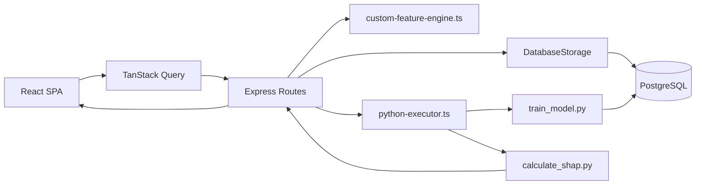

# ML Orion Rebuild Handoff

This document is for a developer who needs to rebuild, extend, or hand over ML Orion without reverse-engineering the codebase from scratch.

It is intentionally implementation-first. It explains what the product does, which parts are real versus supportive scaffolding, how the runtime is wired, what data is persisted, how the ML workflow behaves, and which files are the actual control points.

If you only need orientation, read `docs/developer-guide.md` first. If you need to reproduce the application and continue development safely, use this document as the primary reference.

## 1. What The Application Actually Is

ML Orion is a single-repository churn intelligence platform for copper broadband churn analysis and model operations.

It combines two product surfaces on one stack:

- A business intelligence surface for churn monitoring, risk segmentation, retention actions, revenue impact, and strategy views.
- An ML operations surface called Orion for uploading datasets, profiling data, engineering features, training models, deploying models, scoring customers, monitoring drift and performance, and maintaining governance records.

The most important architectural truth is this:

The application is not split into separate frontend, API, feature store, model serving, and MLOps services. It is one Node.js application that serves the React frontend, exposes the API, talks to PostgreSQL, and shells out to Python scripts for training and explainability.

That means when another developer changes the system, they are usually changing one of four control planes:

- React page behavior in `client/`
- Express route orchestration in `server/routes.ts`
- persistence and analytics logic in `server/storage.ts`
- Python ML behavior in `server/python-ml/`

## 2. Product Capabilities

The current application implements all of the following categories.

### Business intelligence capabilities

- Command center KPIs and portfolio-level churn metrics
- Churn diagnostics by reason, type, geography, and segment
- Risk intelligence views for customer risk distribution
- Retention center workflows around recommendations and execution status
- Business impact reporting for save value and revenue exposure
- Strategy views for regional and portfolio decision support

### Orion ML capabilities

- CSV dataset upload and metadata capture
- dataset quality checking
- EDA generation
- feature selection scoring
- custom feature definition, validation, preview, save, and delete
- model training from uploaded datasets
- model training against the operational customer dataset
- model comparison through stored metrics and feature importance
- model deployment and undeployment
- approval workflow and audit logging
- customer scoring against a selected model
- production scoring against the latest operational customer base
- SHAP-style driver generation and recommendation text generation
- monitoring snapshots including PSI, KS, score histograms, and feature summaries
- governance overview and audit history
- code explorer endpoints used by the Orion overview surface

### Support and bridge capabilities

- notebook output bridge endpoints for importing externally produced predictions
- auto schema bootstrap on server startup
- auto seed of demo copper churn data on startup

## 3. Runtime Topology

At runtime, the application behaves like this:



Important consequences of this design:

- There is no standalone model-serving microservice.
- Deploying a model means setting flags and metadata in the `ml_models` table.
- Scoring is executed through backend routes and then persisted into `predictions` and `recommendations`.
- Uploaded datasets live inside the application database, not in object storage.
- The backend is the orchestration hub. The frontend is mostly an API consumer and workflow shell.

## 4. Exact Tech Stack And Where It Is Used

### Frontend

- React 18: page and component rendering in `client/src/`
- TypeScript: entire frontend and backend codebase
- Wouter: SPA routing in `client/src/App.tsx`
- TanStack Query: data fetching and cache invalidation in `client/src/lib/queryClient.ts` and route pages
- Tailwind CSS: utility styling via `client/src/index.css` and `tailwind.config.ts`
- shadcn-style component layer: reusable UI wrappers in `client/src/components/ui/`
- Radix UI: dialogs, tabs, popovers, accordions, selects, and other primitives under `client/src/components/ui/`
- Recharts: charts in dashboard and Orion pages, wrapped partly by `client/src/components/ui/chart.tsx`
- Lucide React and react-icons: iconography across the UI
- Framer Motion: motion support where used in pages and components

### Backend

- Node.js: runtime for the application server
- Express 5: request handling in `server/index.ts` and `server/routes.ts`
- Multer: in-memory CSV upload handling in `server/routes.ts`
- PapaParse: CSV parsing for uploaded datasets and stored CSV reconstruction in `server/routes.ts`
- simple-statistics: EDA and quality calculations in `server/routes.ts`
- zlib: compression of uploaded CSV content into the dataset storage payload in `server/routes.ts`

### Persistence and contracts

- PostgreSQL: primary data store
- pg: low-level database driver in `server/db.ts`
- Drizzle ORM: CRUD and query building in `server/storage.ts`
- Drizzle Kit: schema push command in `package.json` and config in `drizzle.config.ts`
- Zod: runtime validation and custom feature contracts in `shared/schema.ts`
- drizzle-zod: insert schema generation in `shared/schema.ts`

### ML subsystem

- Python 3: model training and explainability subprocess runtime
- pandas and numpy: dataset manipulation in `server/python-ml/`
- scikit-learn: baseline models and evaluation metrics
- XGBoost: supported training algorithm and common fallback for gradient boosting behavior
- LightGBM: optional algorithm path handled defensively in Python
- SHAP: explanation generation
- Groq SDK: optional recommendation/narrative generation when `GROQ_API_KEY` exists

### Tooling and build

- Vite: frontend development and production build
- @vitejs/plugin-react: React support for Vite
- esbuild: production server bundle generation in `script/build.mjs`
- tsx: TypeScript execution for development server
- xlsx: workbook generation for the implementation tracker script

### Present but not central

Some installed packages are either lightly used, historical, or prepared for possible expansion. Examples include `passport`, `express-session`, `connect-pg-simple`, `memorystore`, and `ws`. They are not the core runtime path for the application as currently wired.

## 5. Required Local Environment

To run the application reliably, assume the following baseline:

- Node.js 20 or later
- npm
- Python 3.10 or 3.11
- PostgreSQL

### Environment variables

These are the important runtime variables inferred from the code.

| Variable | Required | Purpose |
| --- | --- | --- |
| `DATABASE_URL` | Yes | PostgreSQL connection string used by `server/db.ts` and `drizzle.config.ts` |
| `PORT` | No | HTTP port for the combined server, defaults to `5000` |
| `PYTHON_PATH` | No | Explicit Python executable for `server/python-executor.ts` |
| `PYTHON_ML_DIR` | No | Override path to the `python-ml` folder |
| `GROQ_API_KEY` | No | Enables Groq-backed narrative generation in Python |
| `NODE_ENV` | No | Controls Vite dev mode versus production static serving |
| `REPL_ID` | No | Only relevant to Replit-specific Vite plugins |
| `LD_LIBRARY_PATH` | No | Used on non-Windows systems to help native Python libs resolve correctly |

### Local setup sequence

1. Install Node dependencies with `npm install`.
2. Create a Python virtual environment at `.venv` if you want the backend to pick it up automatically.
3. Install Python dependencies from `server/python-ml/requirements.txt`.
4. Provision PostgreSQL and set `DATABASE_URL`.
5. Start the application with `npm run dev`.

Practical note:

`server/python-executor.ts` checks Python in this order on Windows:

- `PYTHON_PATH`
- `.venv/Scripts/python.exe`
- `python`
- `py -3`
- `python3`

On non-Windows it checks:

- `PYTHON_PATH`
- `.venv/bin/python`
- `python3`
- `python`
- `/usr/bin/python3`

### Startup behavior that matters

When the server starts, `registerRoutes(...)` in `server/routes.ts` does two important things before serving traffic:

- it calls `pushSchema()`
- it calls `seedDatabase()`

That means the current application auto-creates tables and auto-seeds demo data at runtime.

This is useful for demos and local development, but it is not a clean production-grade migration pattern. If another developer is productizing the system, the first hardening step is separating runtime startup from schema migration and seed routines.

## 6. Repository Map And What Each Area Owns

```text
ML_Orion/
|- client/                     Frontend SPA
|- server/                     Express server and orchestration
|- server/python-ml/           Python training and explainability scripts
|- shared/                     Database schema and shared contracts
|- script/                     Build and utility scripts
|- docs/                       Developer-facing documentation
|- attached_assets/            Imported notes and reference material
|- README.md                   Entry-level project summary
|- codebase-structure.md       Lightweight folder map
|- implementation-tracker.xlsx Generated delivery tracker
```

### `client/`

This is the SPA. The critical files are:

- `client/src/main.tsx`: mounts the React tree
- `client/src/App.tsx`: top-level route registration and provider setup
- `client/src/pages/`: route-level screens
- `client/src/components/`: shared display, layout, and Orion-specific widgets
- `client/src/components/ui/`: design-system primitives
- `client/src/lib/queryClient.ts`: common fetch/query behavior

### `server/`

This is the true operational center of the application.

- `server/index.ts`: Express startup, middleware, error handling, dev or prod serving
- `server/routes.ts`: endpoint registration and business workflow orchestration
- `server/storage.ts`: DB CRUD and analytics aggregations
- `server/db.ts`: Drizzle plus PostgreSQL setup
- `server/custom-feature-engine.ts`: validation, formulas, and preview transformations for engineered features
- `server/python-executor.ts`: Python subprocess bridge using temp JSON files
- `server/seed.ts`: generated demo data for customers, churn events, predictions, and recommendations

### `server/python-ml/`

This contains the active model pipeline.

- `train_model.py`: training, comparison, metrics, production scoring support, optional narrative generation
- `calculate_shap.py`: explainability and driver generation
- `requirements.txt`: Python dependencies

Files with a `1` suffix such as `train_model1.py` and `calculate_shap1.py` are alternate or older copies and should not be treated as the primary implementation path.

### `shared/`

This folder exists so both frontend and backend can share a single definition of the domain model.

- `shared/schema.ts` defines the tables, insert schemas, and exported TypeScript types.

### `script/`

- `script/build.mjs`: production build orchestration
- `script/build.ts`: related build support
- `script/generate-implementation-tracker.mjs`: creates the implementation tracker workbook

## 7. Frontend Surface Area

The frontend is route-driven. `client/src/App.tsx` is the authoritative route map.

### Core business routes

- `/`: dashboard or command center
- `/churn-diagnostics/:tab?`
- `/risk-intelligence/:tab?`
- `/retention/:tab?`
- `/business-impact/:tab?`
- `/strategy/:tab?`

These pages are mostly analytics views backed by database aggregations in `server/storage.ts`.

### Orion routes

- `/orion/overview`
- `/orion/data`
- `/orion/experiments`
- `/orion/deploy`
- `/orion/outcomes`
- `/orion/governance`

These are the applied ML operations workflows.

### Demo and alternate routes

There are additional route targets such as `demo-orion.tsx`, `demo-orion1.tsx`, `orion-overview1.tsx`, and similar variants. These are not the primary product path. Another developer should understand them, but should not start system reconstruction around them.

### Frontend state model

The frontend does not own much domain logic.

Its main responsibilities are:

- rendering route-level pages
- calling API endpoints through TanStack Query
- showing loading, mutation, and success states
- packaging form data such as file uploads and train configurations
- invalidating caches after mutations

When behavior looks complex on the frontend, the real business decision usually lives in one of these files:

- `server/routes.ts`
- `server/storage.ts`
- `server/custom-feature-engine.ts`
- Python scripts under `server/python-ml/`

## 8. Data Model And What Each Table Means

`shared/schema.ts` is the source of truth.

### `customers`

Purpose:

- operational customer base
- source data for business dashboards
- source data for live training and production scoring

Key fields:

- account identity: `accountNumber`, `name`
- geography: `region`, `state`
- commercial profile: `monthlyRevenue`, `contractStatus`, `valueTier`, `bundleType`
- service quality signals: `provisionedSpeed`, `actualSpeed`, `outageCount`, `ticketCount`, `avgResolutionHours`, `npsScore`
- competition and infrastructure signals: `fiberAvailable`, `competitorAvailable`
- churn labels and risk: `churnRiskScore`, `churnRiskCategory`, `isChurned`, `churnDate`, `churnReason`
- billing and customer context: `lastBillAmount`, `paymentHistory`, `autoPayEnabled`, `premisesType`, `lifecycleStage`

### `churn_events`

Purpose:

- historical record of actual churn outcomes and downstream reporting

Key fields:

- `customerId`, `churnDate`, `churnType`, `reason`, `destination`, `revenueImpact`, `winBackAttempted`, `winBackSuccessful`

### `datasets`

Purpose:

- registry of uploaded modeling datasets and their attached analysis artifacts

Key fields:

- metadata: `name`, `fileName`, `rowCount`, `columnCount`, `uploadedAt`, `status`
- schema summary: `columns`
- reports: `qualityReport`, `edaReport`, `featureReport`
- stored payload: `dataPreview`

Important detail:

Despite the name, `dataPreview` is not only a preview. In the active implementation it also stores compressed raw CSV content using a gzip plus base64 encoding payload. The helper `buildDatasetStoragePayload(...)` in `server/routes.ts` writes:

- `preview`
- `sample`
- `compressedCsvBase64`
- `csvEncoding`
- `storageVersion`

This is why the backend can reconstruct full dataset rows later without separate file storage.

### `ml_models`

Purpose:

- experiment registry and deployment registry

Key fields:

- identity and lineage: `name`, `datasetId`, `algorithm`
- lifecycle: `status`, `isDeployed`, `deployedAt`
- metrics: `accuracy`, `precision`, `recall`, `f1Score`, `auc`
- model artifacts and explainability metadata: `hyperparameters`, `featureImportance`, `confusionMatrix`, `modelWeights`
- governance: `approvalStatus`, `approvedBy`, `approvedAt`, `approvalNotes`

### `predictions`

Purpose:

- persisted scoring output for a given model and customer

Key fields:

- `modelId`, `customerId`, `churnProbability`, `riskCategory`, `topDrivers`, `recommendedAction`, `actionCategory`, `predictedAt`

### `recommendations`

Purpose:

- human-action layer downstream of predictions

Key fields:

- `customerId`, `predictionId`
- action content: `actionType`, `description`
- prioritization and economics: `priority`, `estimatedImpact`, `estimatedCost`
- execution tracking: `status`, `executedAt`, `outcome`, `createdAt`

### `audit_log`

Purpose:

- governance timeline across approvals, deployments, and workflow events

Key fields:

- `action`, `entityType`, `entityId`, `entityName`, `detail`, `user`, `team`, `status`, `createdAt`

### `model_evaluation_runs`

Purpose:

- periodic monitoring snapshots for a model on a given evaluation month

Key fields:

- identifiers: `modelId`, `datasetId`, `evaluationMonth`
- label-aware metrics: `auc`, `accuracy`, `recall`, `precision`, `f1Score`, `ks`, `positiveCount`, `negativeCount`
- label-agnostic monitoring metrics: `rowCount`, `psi`, `highRiskPct`, `medRiskPct`, `lowRiskPct`, `scoreHistogram`, `topFeatureShapSummary`, `hasLabels`

## 9. Backend Responsibilities By File

### `server/index.ts`

This file is small but operationally important.

It does all of the following:

- creates the Express app and HTTP server
- installs JSON and URL-encoded body parsing
- captures raw request bodies for JSON requests
- logs API responses with timing information
- registers all routes by calling `registerRoutes(httpServer, app)`
- sets centralized error handling
- mounts Vite middleware in development
- serves `dist/public` in production
- listens on `PORT` or `5000`

### `server/routes.ts`

This is the most important file in the repository.

It is not just a route declaration file. It also performs:

- startup schema push
- startup seeding
- dataset parsing and reconstruction
- EDA and quality computations
- feature selection calculations
- custom feature persistence and preview orchestration
- model training orchestration
- live scoring orchestration
- deployment and approval state changes
- monitoring metric computation
- code explorer support

This file is effectively the application service layer.

### `server/storage.ts`

This file encapsulates database operations and analytics aggregation logic.

It owns:

- CRUD for all major tables
- aggregation for dashboard and analytics screens
- retrieval helpers for models, predictions, recommendations, and audit history
- monitoring run persistence
- clean-up logic when datasets or models are deleted

This means business screens such as dashboard, churn diagnostics, retention, business impact, and strategy are primarily data-aggregation products of `storage.ts`, not frontend calculations.

### `server/custom-feature-engine.ts`

This file powers dataset feature engineering in Orion.

Supported feature families are defined in `shared/schema.ts` and include:

- `rolling`
- `lag`
- `trend`
- `ratio`
- `flag`
- `segment_tag`
- `interaction`

The feature engine validates configuration, generates formulas, applies transformations to row sets, and builds preview rows for the UI.

### `server/python-executor.ts`

This is the bridge between Node and Python.

It works like this:

1. Determine the usable `python-ml` directory.
2. Resolve a Python executable candidate list.
3. Write input JSON to a temp file.
4. Spawn the Python script with input and output file arguments.
5. Read the output JSON file.
6. Fall back to parsing JSON from stdout if needed.
7. Clean up temp files.

This bridge is important because the ML scripts are not HTTP services. They are subprocess jobs.

## 10. API Surface By Workflow

The route list in `server/routes.ts` can be understood in groups.

### Portfolio analytics and dashboard APIs

- `GET /api/dashboard`
- `GET /api/segments`
- `GET /api/analytics/command-center`
- `GET /api/analytics/churn-diagnostics`
- `GET /api/analytics/risk-intelligence`
- `GET /api/analytics/retention`
- `GET /api/analytics/business-impact`
- `GET /api/analytics/strategy`

These mostly read from customers, churn events, predictions, and recommendations through `server/storage.ts`.

### Customer and prediction APIs

- `GET /api/customers`
- `GET /api/customers/stats`
- `GET /api/customers/:id`
- `POST /api/customers/shap-drivers`
- `GET /api/predictions`
- `GET /api/recommendations`
- `PATCH /api/recommendations/:id`
- `GET /api/churn-events`

These routes support risk drilldowns, customer views, driver explanations, and retention action tracking.

### Dataset management APIs

- `GET /api/datasets`
- `GET /api/datasets/unique-account-counts`
- `GET /api/datasets/:id`
- `POST /api/datasets/upload`
- `DELETE /api/datasets/:id`

The upload route accepts CSV, parses it in memory, profiles the columns, stores preview data, and persists the dataset record.

### Dataset profiling APIs

- `POST /api/datasets/:id/quality-check`
- `POST /api/datasets/:id/eda`
- `POST /api/datasets/:id/feature-selection`

These enrich the dataset record by writing JSON reports back to the same `datasets` row.

### Custom feature APIs

- `GET /api/datasets/:id/custom-features`
- `POST /api/datasets/:id/custom-features/validate`
- `POST /api/datasets/:id/custom-features/preview`
- `POST /api/datasets/:id/custom-features`
- `DELETE /api/datasets/:id/custom-features/:featureId`

These use `server/custom-feature-engine.ts` and store the canonical custom feature list under `dataset.featureReport.customFeatures`.

### Model lifecycle APIs

- `GET /api/models`
- `GET /api/models/:id`
- `POST /api/models/train`
- `POST /api/models/train-live`
- `POST /api/models/:id/deploy`
- `POST /api/models/:id/undeploy`
- `POST /api/models/:id/approve`
- `DELETE /api/models/:id`
- `GET /api/models/latest/features`

These routes create experiment records, store metrics, manage deployment state, and attach governance state.

### Orion-specific operational APIs

- `GET /api/orion/eda-live`
- `GET /api/orion/overview`
- `GET /api/orion/customer-dataset`
- `POST /api/models/:id/predict-customers`
- `POST /api/models/:id/score-production`
- `GET /api/orion/governance`
- `GET /api/monitoring/:modelId`

These are the routes behind the Orion overview, data, deploy, outcomes, and governance pages.

### Notebook and code explorer bridge APIs

- `GET /api/notebook-output`
- `POST /api/import-notebook-predictions`
- `GET /api/code/files`
- `GET /api/code/:fileId`
- `GET /api/orion/algorithms`

`/api/orion/algorithms` is useful because it derives the algorithm choices from the active Python training implementation rather than hard-coding them purely in the frontend.

## 11. End-To-End Workflow: Upload CSV To See Predictions

This is the most important feature chain in the product.

### Step 1: Upload dataset

The user uploads a CSV from the Orion Data page.

Backend behavior:

- Multer reads the file into memory.
- PapaParse parses the CSV into rows.
- column metadata is inferred.
- a preview and sample are created.
- the full CSV is compressed into base64 and stored in `dataset.dataPreview`.
- a `datasets` row is inserted with status `uploaded`.

### Step 2: Run quality check

The frontend calls `POST /api/datasets/:id/quality-check`.

Backend behavior:

- reconstruct dataset rows from the stored payload
- compute missing values, duplicates, basic health indicators, and quality summaries
- write `qualityReport` back to the dataset row

### Step 3: Run EDA

The frontend calls `POST /api/datasets/:id/eda`.

Backend behavior:

- reconstruct rows again
- identify numeric versus categorical patterns
- compute correlations and distributions
- store the result in `edaReport`

### Step 4: Run feature selection

The frontend calls `POST /api/datasets/:id/feature-selection`.

Backend behavior:

- use EDA outputs and dataset schema
- generate feature scores and rankings
- store the result in `featureReport`

### Step 5: Define custom features if needed

The user can validate and preview features before saving them.

Backend behavior:

- validate the feature definition against the Zod schema
- build a human-readable formula string
- apply preview transformations using `server/custom-feature-engine.ts`
- persist the accepted feature list into `dataset.featureReport.customFeatures`

### Step 6: Train a model

The frontend calls `POST /api/models/train` with a dataset id and training configuration.

Backend behavior:

- load dataset rows from the stored CSV payload
- apply any saved custom features
- package the training payload into JSON
- call `executePythonScript("train_model.py", ...)`
- receive metrics, feature importance, algorithm result, and model artifact payload
- insert a row into `ml_models`

### Step 7: Approve and deploy the model

The user uses the Orion Deploy page.

Backend behavior:

- set approval fields in `ml_models`
- write governance entries into `audit_log`
- mark the chosen model as deployed and unset deployment on others as needed

### Step 8: Score customers

The frontend triggers either:

- `POST /api/models/:id/predict-customers` for selected customers or scoped scoring
- `POST /api/models/:id/score-production` for production-style scoring on the live customer base

Backend behavior:

- load customer rows from the `customers` table or the requested scoring cohort
- apply the trained feature logic if needed
- call Python for prediction and explanation support
- create `predictions` records
- create `recommendations` records
- return counts and risk buckets to the UI

### Step 9: View predictions and outcomes

The frontend reads:

- `GET /api/predictions`
- `GET /api/recommendations`
- `GET /api/monitoring/:modelId`
- `GET /api/orion/governance`

This powers deploy, outcomes, retention, and governance screens.

## 12. Live Operational Workflow: Customers Table To Production Scoring

The second major workflow does not start from a user-uploaded dataset.

Instead it uses the operational `customers` table seeded by `server/seed.ts` or populated by real data.

Relevant features:

- `POST /api/models/train-live`
- `GET /api/orion/customer-dataset`
- `GET /api/orion/eda-live`
- `POST /api/models/:id/score-production`

This is the path that makes Orion feel like an always-on churn control tower instead of a one-off offline experimentation tool.

## 13. How The Business Screens Work

The business pages are mostly read-side projections over the transactional data.

### Dashboard

Uses `GET /api/analytics/command-center`.

Expected output:

- top KPIs
- trend summaries
- risk and churn portfolio views
- action and revenue summaries

### Churn Diagnostics

Uses `GET /api/analytics/churn-diagnostics`.

Expected output:

- churn reasons
- churn types
- churn distribution by segment or geography
- supporting drilldown data

### Risk Intelligence

Uses `GET /api/analytics/risk-intelligence`.

Expected output:

- risk bucket mix
- high-risk population views
- likely driver breakdowns

### Retention Center

Uses recommendation and prediction data.

Expected output:

- pending and completed actions
- estimated impact and cost
- action status changes
- retention workflow queues

### Business Impact

Uses `GET /api/analytics/business-impact`.

Expected output:

- at-risk revenue
- save value
- intervention economics
- portfolio-level impact framing

### Strategy Insights

Uses `GET /api/analytics/strategy`.

Expected output:

- regional patterns
- segment-based priorities
- migration or save opportunities

The important thing for a new developer is that these pages are not separate products. They are downstream analytical views over the same data model used by Orion.

## 14. How Each Orion Screen Maps To The Backend

### Orion Overview

Primary purpose:

- summary of datasets, model inventory, deployment state, and code exploration widgets

Primary APIs:

- `GET /api/orion/overview`
- `GET /api/models`
- `GET /api/code/files`
- `GET /api/code/:fileId`

### Orion Data

Primary purpose:

- upload datasets, inspect schema, run quality checks, run EDA, run feature selection, and manage custom features

Primary APIs:

- `GET /api/datasets`
- `POST /api/datasets/upload`
- `POST /api/datasets/:id/quality-check`
- `POST /api/datasets/:id/eda`
- `POST /api/datasets/:id/feature-selection`
- custom feature endpoints
- `GET /api/orion/customer-dataset`
- `GET /api/orion/eda-live`

### Orion Experiments

Primary purpose:

- train models from uploaded or live data and compare experiment results

Primary APIs:

- `GET /api/models`
- `POST /api/models/train`
- `POST /api/models/train-live`
- `GET /api/orion/algorithms`

### Orion Deploy

Primary purpose:

- approve, deploy, undeploy, score, and monitor models

Primary APIs:

- `POST /api/models/:id/approve`
- `POST /api/models/:id/deploy`
- `POST /api/models/:id/undeploy`
- `POST /api/models/:id/predict-customers`
- `POST /api/models/:id/score-production`
- `GET /api/monitoring/:modelId`

### Orion Outcomes

Primary purpose:

- show the downstream effect of predictions and recommendations

Primary APIs:

- `GET /api/predictions`
- `GET /api/recommendations`
- business analytics endpoints where rollups are reused

### Orion Governance

Primary purpose:

- show audit history, approvals, deployment events, and governance status

Primary APIs:

- `GET /api/orion/governance`
- `GET /api/audit-log`
- `POST /api/audit-log`

## 15. ML Training And Explainability Subsystem

The Python layer is the active ML engine, not a secondary prototype.

### `train_model.py`

This file is responsible for:

- receiving prepared JSON input from Node
- selecting or running algorithms
- preprocessing features
- splitting data and evaluating model quality
- returning metrics and feature importance
- supporting auto-model selection behavior
- optionally using Groq for generated narrative content when configured

### `calculate_shap.py`

This file is responsible for:

- generating explainability outputs for scored customers
- creating top-driver style reasoning payloads
- optionally generating richer recommendation language

### Model artifact behavior

The application does not expose a separate binary model registry service. Instead, model outputs are stored as structured JSON fields in the `ml_models` row, including pieces such as:

- hyperparameters
- feature importance
- confusion matrix
- model weights or model snapshot data

That means reconstruction of the platform should preserve database-backed model metadata even if artifact storage evolves later.

## 16. Build And Deployment Behavior

The production build is controlled by `script/build.mjs`.

It does the following:

1. remove the existing `dist` folder
2. build the frontend with Vite into `dist/public`
3. bundle the server with esbuild into `dist/index.cjs`
4. copy `server/python-ml` into `dist/python-ml`

The fourth step matters. Without copying the Python assets, the built server cannot run training or SHAP jobs.

Runtime path resolution in `server/python-executor.ts` checks these candidate directories for Python assets:

- `PYTHON_ML_DIR`
- `server/python-ml`
- `dist/python-ml`
- `__dirname/python-ml`

That is why both local development and built production bundles can find the scripts.

## 17. Important Behavioral Truths And Gotchas

These are the things another developer is most likely to misunderstand.

### The route file is doing service-layer work

`server/routes.ts` is much larger than a typical Express route declaration file. Treat it as orchestration code, not just transport glue.

### Dataset storage is denormalized on purpose

Uploaded CSVs are reconstructed from a compressed payload stored inside `datasets.dataPreview`. If you remove that behavior without replacing it, downstream EDA, feature engineering, and training will stop working.

### Startup mutates the database

The app pushes schema and seeds data on startup. This is convenient for demos but risky for production. Keep this in mind before changing database lifecycle behavior.

### Deployment is logical, not infrastructural

There is no separate model-serving environment. A deployed model is a database row marked as deployed and then used by scoring routes.

### Predictions create recommendations

Scoring is not only about probabilities. The scoring pipeline also creates actionable recommendation rows.

### Monitoring depends on stored evaluation runs

Monitoring screens are backed by `model_evaluation_runs`. If you change scoring or evaluation logic, ensure monitoring snapshots remain populated.

### The business screens and Orion share the same facts

Do not mentally split the app into an analytics dashboard and a separate ML product. They are two lenses over the same operational data model.

### Some files are alternates or historical

Examples include:

- `server/routes1.ts`
- `client/src/pages/*1.tsx`
- `server/python-ml/train_model1.py`
- `server/python-ml/calculate_shap1.py`

These should not be the foundation for new work unless you intentionally decide to revive them.

## 18. Recommended Rebuild Order For Another Developer

If someone had to reproduce this product in a clean repository, this is the correct order.

1. Recreate the shared domain schema first.
2. Build the Express server bootstrap and health of the DB connection.
3. Recreate the core tables: customers, churn events, datasets, models, predictions, recommendations, audit log, monitoring runs.
4. Implement storage methods and analytics aggregations.
5. Implement dataset upload and persisted CSV reconstruction.
6. Implement quality check, EDA, and feature selection.
7. Implement the custom feature engine.
8. Implement the Python bridge.
9. Recreate Python training and SHAP workflows.
10. Build model lifecycle routes: train, approve, deploy, undeploy, delete.
11. Build scoring routes that write predictions and recommendations.
12. Build monitoring and governance routes.
13. Build the React shell, route map, and query client.
14. Build the Orion Data and Experiments pages.
15. Build Deploy, Outcomes, and Governance pages.
16. Build business intelligence pages using storage-layer aggregations.
17. Add code explorer and notebook bridge features only after the core workflow works.

This order matters because the product is backend-first in terms of real complexity.

## 19. Where To Make Changes Safely

Use this rule of thumb.

### Change a metric or business aggregation

Start in `server/storage.ts`.

### Change API response shape or workflow sequence

Start in `server/routes.ts`.

### Change uploaded dataset processing or engineered features

Start in `server/custom-feature-engine.ts` and the dataset routes in `server/routes.ts`.

### Change model behavior or explanation quality

Start in `server/python-ml/train_model.py` or `server/python-ml/calculate_shap.py`.

### Change navigation, screen composition, or user interactions

Start in `client/src/App.tsx` and the relevant route page under `client/src/pages/`.

### Change schema, entity fields, or shared types

Start in `shared/schema.ts`, then reconcile storage, routes, and frontend usage.

## 20. Minimum Mental Model A New Developer Should Leave With

If a developer understands these five points, they can work productively in this repository.

1. This is one full-stack app, not a fleet of services.
2. `server/routes.ts` is the orchestration center.
3. `server/storage.ts` powers most analytical screens.
4. `datasets.dataPreview` contains the persisted raw dataset payload used by downstream ML workflows.
5. Model deployment and scoring are database-backed application workflows, with Python invoked as a subprocess when training or explanation is needed.

## 21. Suggested First Files To Read In Order

For a fresh developer handoff, this is the best reading sequence.

1. `README.md`
2. `docs/developer-guide.md`
3. `docs/rebuild-handoff.md`
4. `client/src/App.tsx`
5. `server/index.ts`
6. `server/routes.ts`
7. `server/storage.ts`
8. `shared/schema.ts`
9. `server/custom-feature-engine.ts`
10. `server/python-executor.ts`
11. `server/python-ml/train_model.py`
12. `server/python-ml/calculate_shap.py`

That path mirrors the actual runtime chain from browser to API to database to Python.